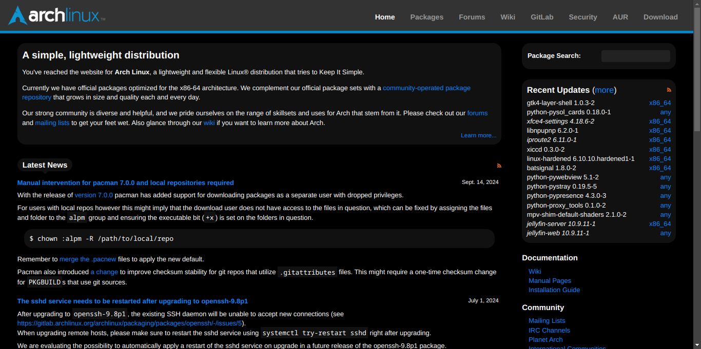

# Arch Linux Dark

Dark theme for some (simpler) Arch Linux pages: Home, Packages, AUR and Download.

For the AUR cgit, dark mode styles from [cgit homepage](https://git.zx2c4.com/cgit/) are copied as is.

Since the Wiki is a different kind of beast, I recommend [Wikipedia-Dark](https://github.com/StylishThemes/Wikipedia-Dark). 🚀

