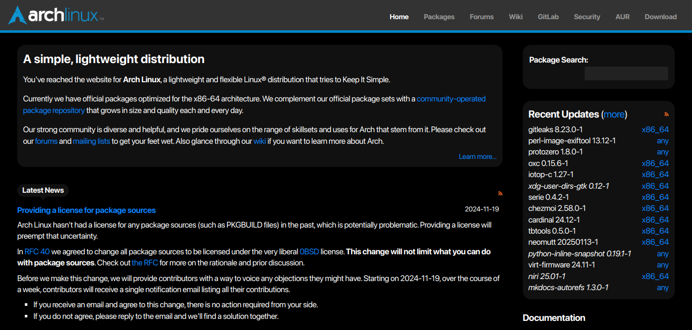

# Arch Linux Dark

[Install](https://raw.githubusercontent.com/aruncveli/userstyles/refs/heads/main/sites/archlinux/archlinux.user.css)

Dark theme for most of the Arch Linux pages.

For the AUR cgit, dark mode styles from
[cgit homepage](https://git.zx2c4.com/cgit/) are copied as is.

For the Wiki turn on the built-in dark mode or [Wikipedia-Dark](https://github.com/StylishThemes/Wikipedia-Dark).

