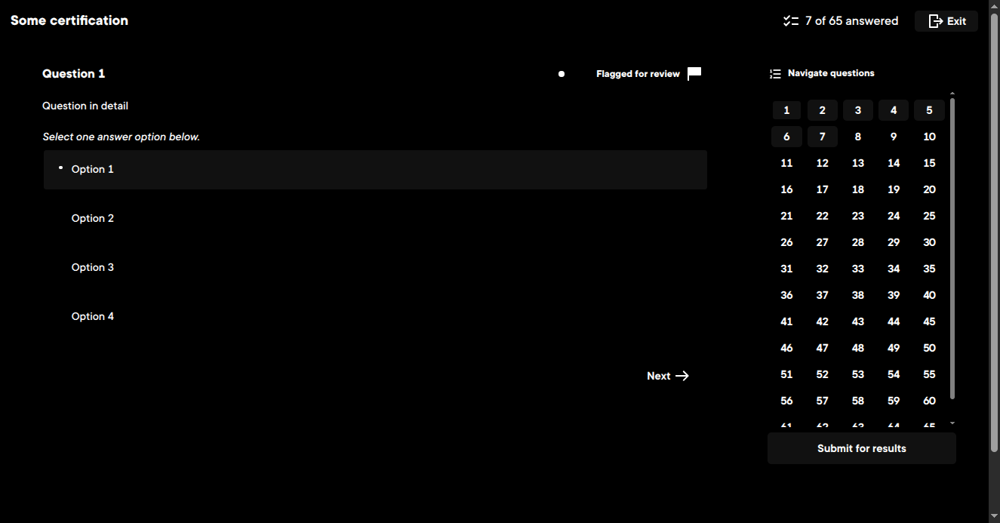

# Pluralsight Dark

[Install](https://raw.githubusercontent.com/aruncveli/userstyles/refs/heads/main/sites/pluralsight/pluralsight.user.css)

Only the practice tests are covered as of now, since that is where I spend most of my time on Pluralsight.

