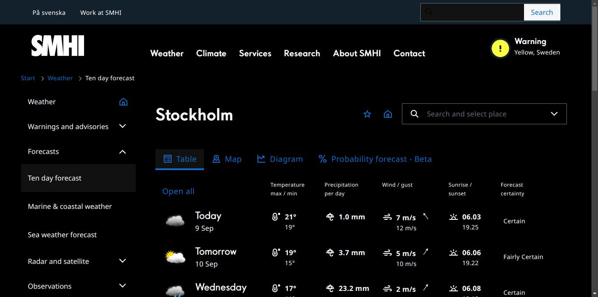

# SMHI Dark

Dark theme for SMHI's [ten day forecast](https://www.smhi.se/en/weather/forecasts/ten-day-forecast/). [SMHI](https://en.wikipedia.org/wiki/Swedish_Meteorological_and_Hydrological_Institute) is the Swedish government agency for weather forecasts.

