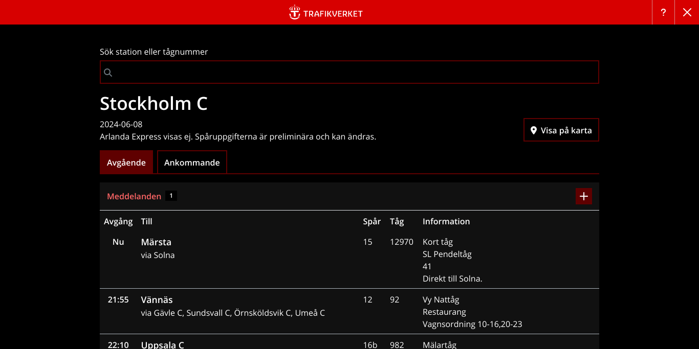

# Trafikinformation tåg

Official [train info](https://www.trafikverket.se/trafikinformation/tag) page from Trafikverket.

Link and link hover color variables are accepting inputs as `R,G,B` string, since Boostrap `rgb` variables need them so.

